# KODE - Code Editor

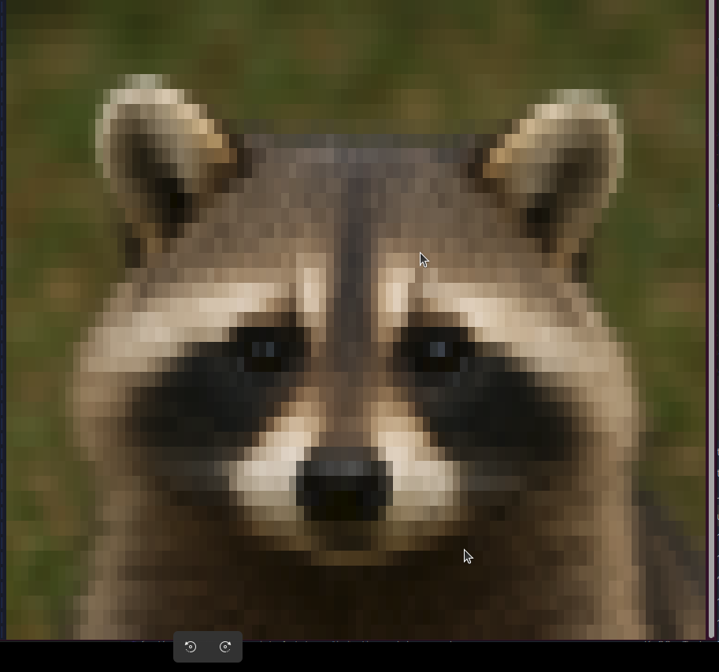

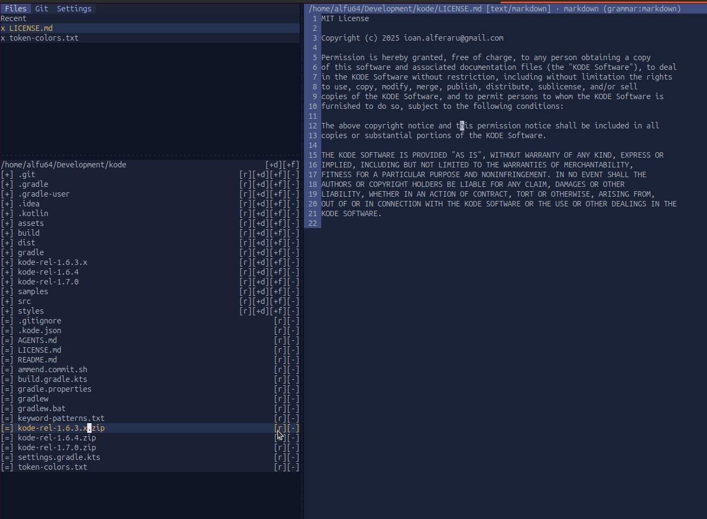
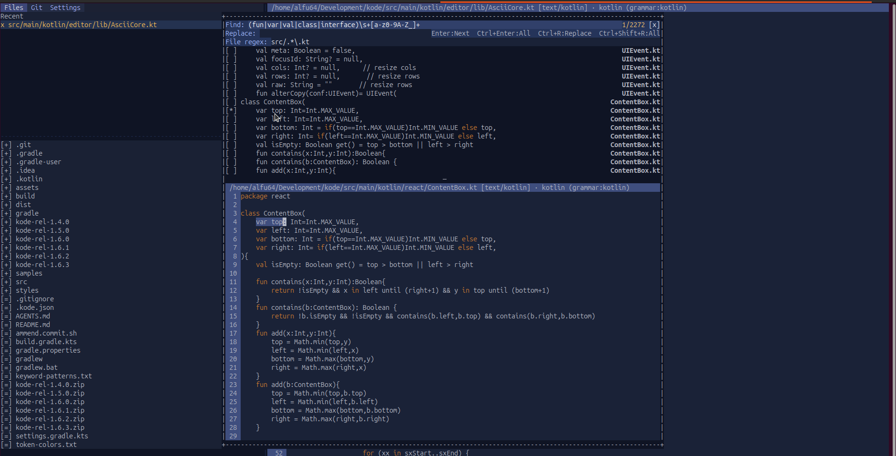

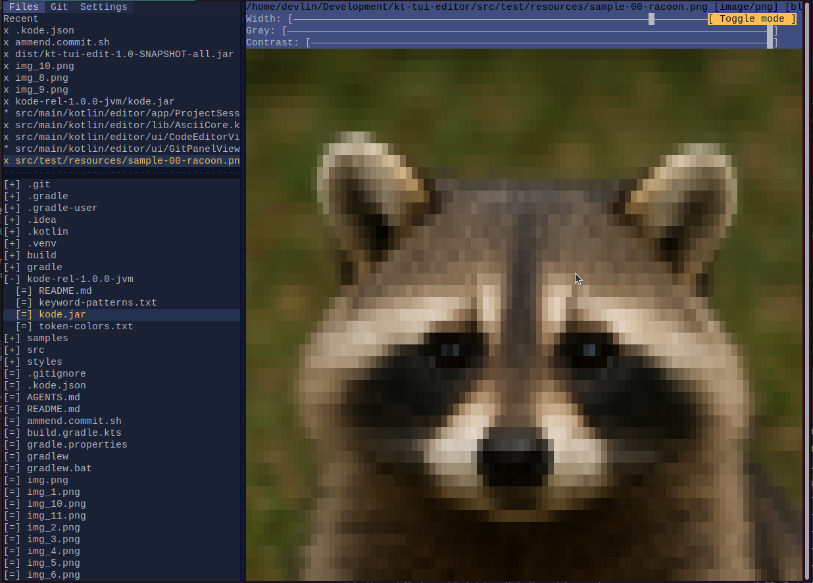
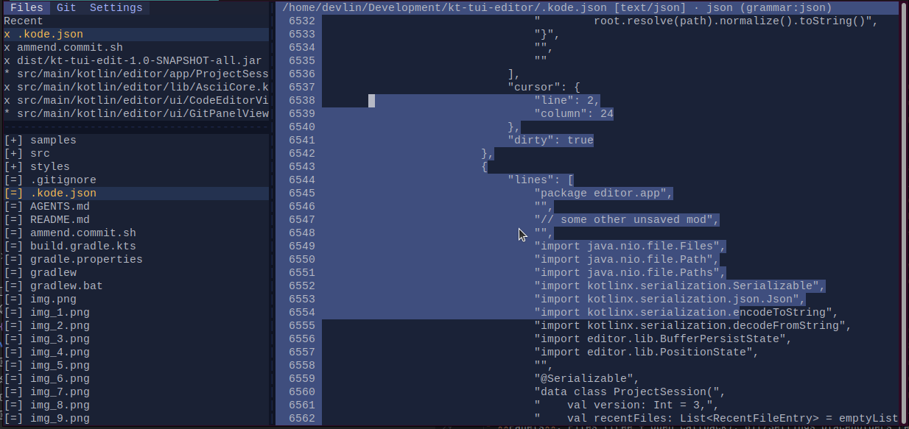
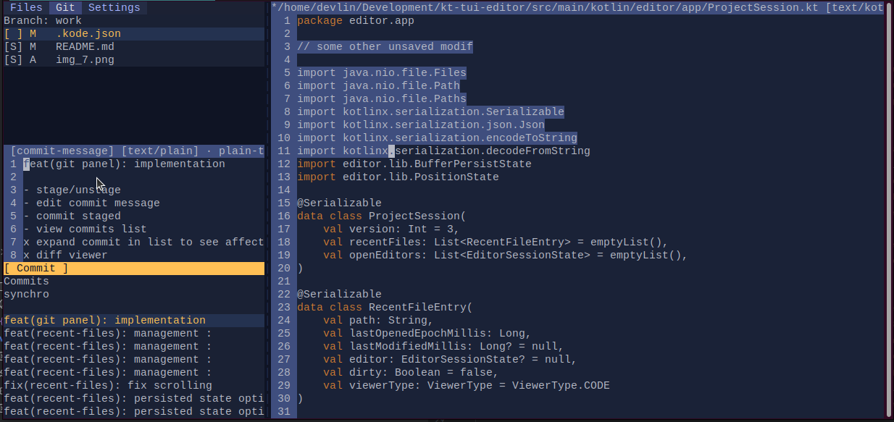
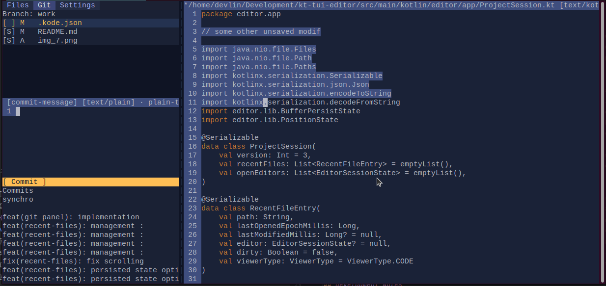

## Objectives
- Build a terminal-first editor workspace with split panes, tabs, and multiple viewers (code, hex, image) selected by MIME.
- Keep the renderer/input loop robust: raw mode, mouse resize/drag, focus handoff, and low-flicker double-buffered drawing.
- Maintain modularity: rendering, buffers (text/byte), MIME detection, grammars, and viewers evolve independently, with shared style helpers on renderer/style set.

## Layout & UX
- Split view: left vertical tabs (Files/Git/About/Settings), right viewer chosen by MIME (text → code editor, image → ASCII/Braille image viewer, else hex viewer). Splitter is mouse-draggable.
- Status line: bottom row shows FPS, used memory (MB), and CPU% while leaving the rest of the canvas for the app surface.
- File tree uses [+]/[-]/[=] icons, expands/collapses, and opens files in the right viewer; focus follows click for correct input routing.
- Code editor: guttered view, full mouse/keyboard navigation (select, word-jump, page up/down), cursor/selection rendering, and focus-aware input. Undo/Redo via `Ctrl+Z` and `Ctrl+Shift+Z`/`Ctrl+Y` (redo stack clears on new edits).
- Project state: Kode writes `.kode.json` in the project root (debounced ~3s) to persist recent files and open editor state (cursor/selection/scroll, unsaved buffer text, undo/redo history, grammar/lang, mtime guard). On startup, it restores the project session, including recently opened files and their editor positions; stale entries (older than on-disk mtime) are discarded and reloaded fresh.
- Working folder: defaults to the shell directory you launch from; pass `kode <path>` (e.g., `kode .` or `kode x/y/z`) to open a different root and read/write `.kode.json` there, or click `[change]` in the Files tab header to pick a new workspace folder.
- Find/Replace: `Ctrl+F` opens the IntelliJ-style bar above the code viewport (shrinks content); `Enter` finds next, `Ctrl+Enter` finds all, `Ctrl+R` replaces current, `Ctrl+Shift+R` replaces all, `Tab` switches between find/replace fields, and the `[x]` button closes the bar. The find box accepts regex patterns (invalid patterns turn the box red); replacements honor capture groups via `$1`, `$2`, etc. All matches stay highlighted (with an active-match accent) while the search state lives in the text buffer. `Ctrl+S` saves the current buffer, and the header shows `*` when there are unsaved changes. Selection text pre-fills the find box (escaped for regex) when invoking `Ctrl+F`.
- Project-wide search: `Alt+F` opens a centered modal over the workspace. It reuses the find/replace bar, adds a file-regex filter row (pre-filled with the current file extension), and shows a split view with match hits above (selectable list with highlighted tokens and a `[ ]`/`[*]` marker) and a full editor below. Selecting a hit opens the file in the embedded editor with the match centered; `Ctrl+S` saves directly from this view and updates recents. The embedded editor and hit list both apply syntax colors based on detected language/extension, so matches render with the same token styling as regular editors.
- About panel: lists the current build version, the Kode MIT license, and credits (license links + source URLs) for bundled libraries (JGit, Korim/Korio, kotlinx-coroutines, kotlinx-serialization).
- Installation/run: build generates `kode.sh`/`kode.bat` launchers that set `-Dkode.home` to the install folder, so resources (styles, tm-scopes) load correctly even when binaries are invoked from elsewhere. `kode.jar` lives alongside these scripts in the bundle.
- Code highlighting: keyword-only regex highlighter; patterns come from `keyword-patterns.txt` (language=regex) and colors from `token-colors.txt` (qualifier=hex). Tokens carry fg color directly to avoid stylesheet lookups.
- Hex editor: dual cursors (hex/ASCII), scroll keys, selection, and byte-buffer backing.
- Image viewer: ASCII and Braille modes, width/gray/contrast sliders (mouse drag/click, toggle button), aspect-aware sizing, per-cell color from Korim-rendered samples.

## Architecture Overview
- **Terminal/Renderer**: ANSI canvas with back buffer diffing; `CanvasRenderer.withStyle` and `StyleSet.withDefaults` centralize styling. Raw-mode event loop normalizes key/mouse/resize.
- **Buffers**: `TextBuffer` (cursor, selection, word/nav ops) and `ByteBuffer` (hex editor) power the editors; viewport slicing drives rendering.
- **MIME**: `DefaultMimeTypeDetector` uses a literal lookup table with hardcoded categories (TEXT/IMAGE/BINARY) plus signature/byte-scans; routing picks the viewer accordingly.
- **Grammars**: Lightweight keyword-only regex provider. Patterns are loaded at runtime from `keyword-patterns.txt`; colors from `token-colors.txt`. Tokens include fg color, so the editor skips per-scope stylesheet lookup. A TM4E loader exists (`TmProvider`) but is not wired in by default.
- **Viewers**: Code editor (focus-aware input, optional TM token styling), Hex viewer (byte cursors), Image viewer (Korim ASCII/Braille renderer with per-cell bg/fg and adjustable sliders).
- **UI Components**: TabView for left panel, SliderControl (component with track/indicator styles) for viewer controls, splitter drag logic in `SplitPanelsApp`.
- **Panels**: Files (tree + open callback), Git, About (version/licensing/credits), and a Settings placeholder ready for expansion. File tree and Git panels auto-refresh periodically (~5s) without blocking the render loop, keeping status/commits and directory listings up to date. The file tree header shows the project root with `[+d][+f]`; each folder row has `[r][+d][+f][-]` and each file row `[r][-]` for inline rename/create/delete; clicking `[r]` opens an inline prompt (Enter to apply, click outside to cancel). Resources (styles/grammars) resolve relative to the launcher directory via `kode.home`/`KODE_HOME`.

## Development Notes
- Use `GRADLE_USER_HOME=./.gradle-user ./gradlew build|test|fatJar`; target Java 21. `fatJar` emits `kode-1.0-SNAPSHOT-all.jar`. `distBundle` copies the fat jar plus `token-colors.txt`, `keyword-patterns.txt`, and `styles/app.css` (under `styles/`) into `dist/`. `releaseBundle` packages a release folder `kode-rel-<latest-tag>` with `kode.jar` (renamed fat jar), `keyword-patterns.txt`, `token-colors.txt`, `styles/app.css`, and this README for distribution.
- Syntax config: provide `keyword-patterns.txt` (lines `language=regex`) and `token-colors.txt` (`qualifier=hex`, e.g., `keyword=#CC7832`) next to the jar or in the working directory. Missing/invalid lines will throw with stacktrace on load.
- Test focus/input flows, buffer mutations, MIME routing, and viewer rendering; add fixtures from `samples/` for MIME detection and rendering checks.
- Dependencies: JGit for Git panel, Korim/Korio + coroutines for image loading, TM4E available for TM tokenization, and internal StyleSet/Renderer helpers for consistent styling.
- Tasks: `generateTmScopes` builds `grammars/tm-scopes.css` from grammar scopes (optional if using TM4E). Keep README aligned when adding viewers, sliders, detector/grammar changes; style names live in `styles/app.css` (e.g., `slider-track`, `slider-indicator`, `image-*`, `code-*`).

using in combination with tmux with codex and the command promp
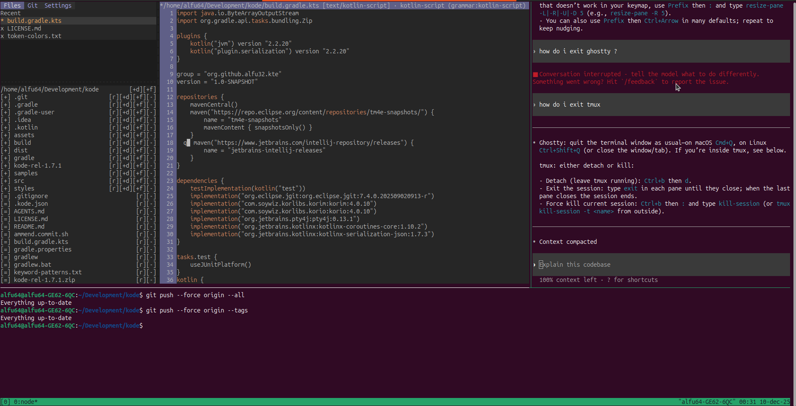

usage of the file management features : renaming file

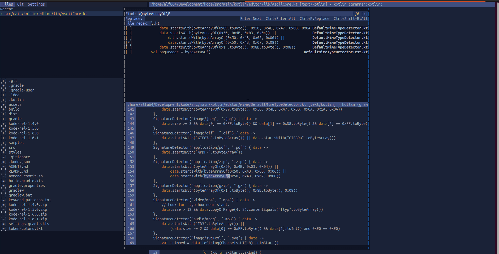

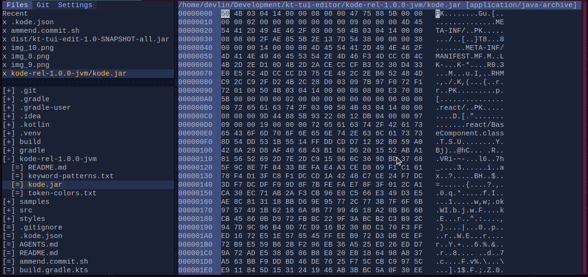

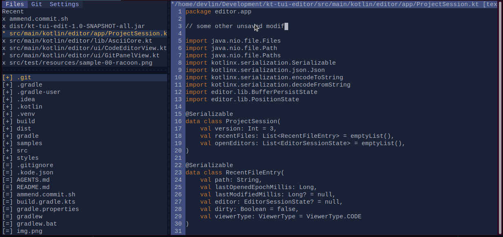
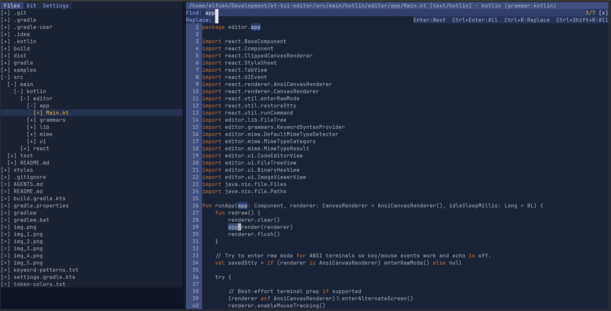
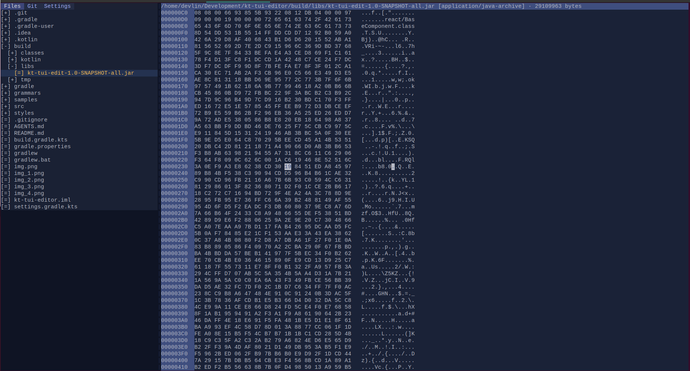
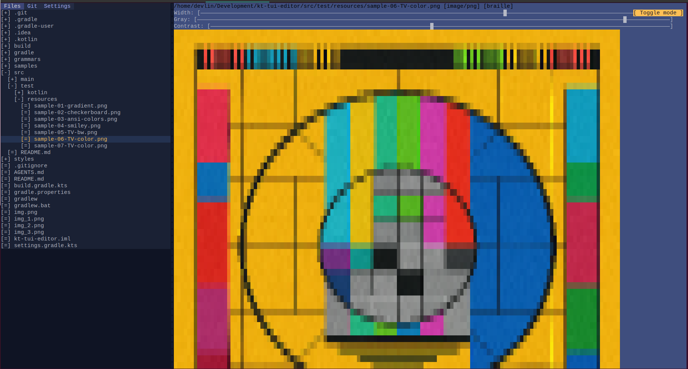
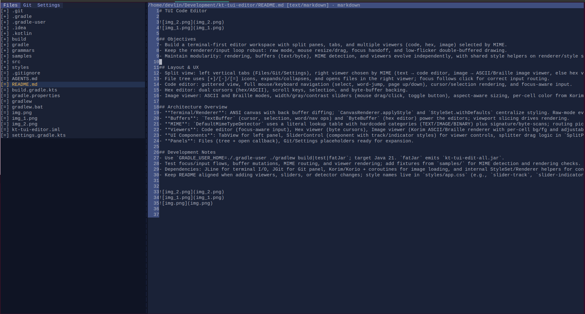
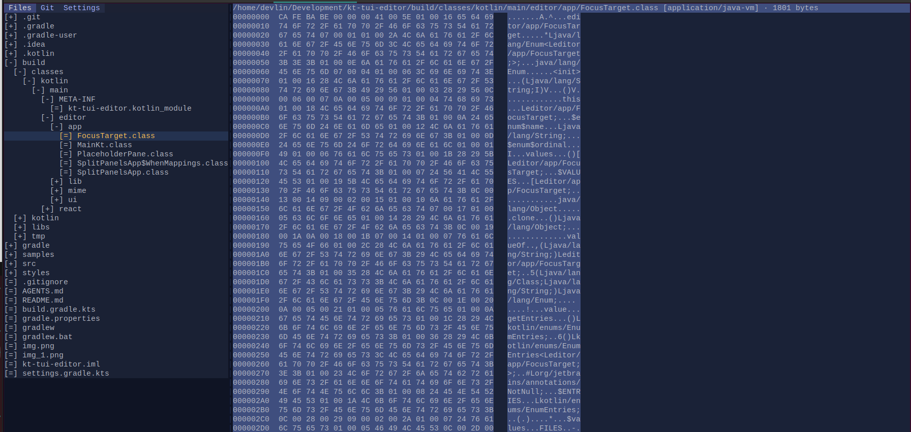
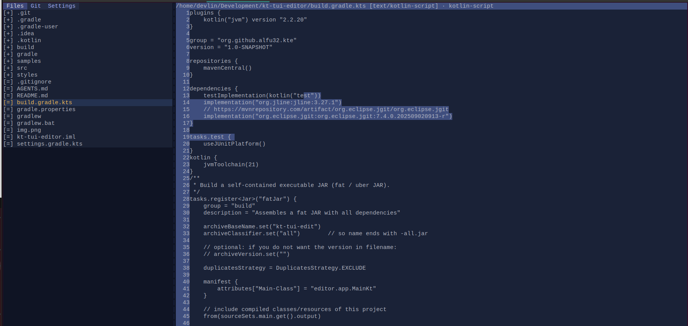

