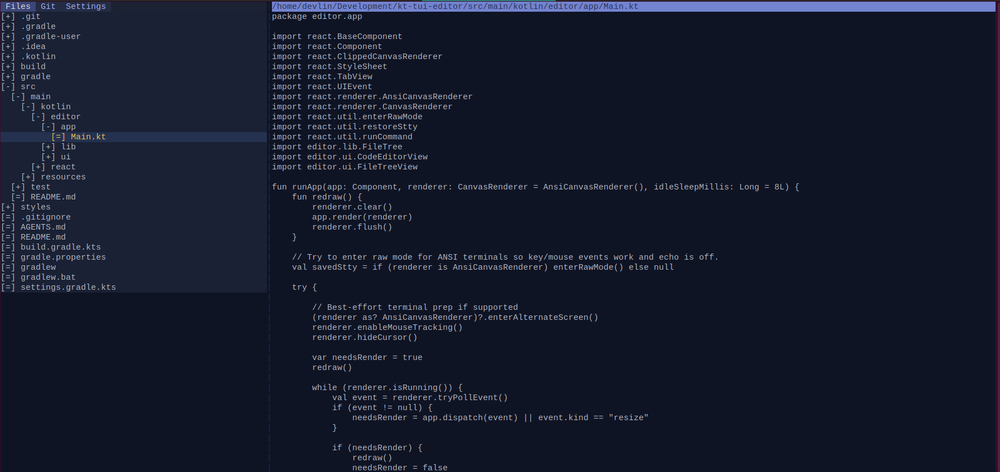

# TUI Code Editor

## Objectives
- Build a terminal-first editor workspace with split panes, tabs, and multiple viewers (code, hex, image) selected by MIME.
- Keep the renderer/input loop robust: raw mode, mouse resize/drag, focus handoff, and low-flicker double-buffered drawing.
- Maintain modularity: rendering, buffers (text/byte), MIME detection, and viewers evolve independently, with shared style helpers on renderer/style set.

## Layout & UX
- Split view: left vertical tabs (Files/Git/Settings), right viewer chosen by MIME (text → code editor, image → ASCII/Braille image viewer, else hex viewer). Splitter is mouse-draggable.
- File tree uses [+]/[-]/[=] icons, expands/collapses, and opens files in the right viewer; focus follows click for correct input routing.
- Code editor: guttered view, full mouse/keyboard navigation (select, word-jump, page up/down), cursor/selection rendering, and focus-aware input.
- Hex editor: dual cursors (hex/ASCII), scroll keys, selection, and byte-buffer backing.
- Image viewer: ASCII and Braille modes, width/gray/contrast sliders (mouse drag/click, toggle button), aspect-aware sizing, per-cell color from Korim-rendered samples.

## Architecture Overview
- **Terminal/Renderer**: ANSI canvas with back buffer diffing; `CanvasRenderer.applyStyle` and `StyleSet.withDefaults` centralize styling. Raw-mode event loop normalizes key/mouse/resize.
- **Buffers**: `TextBuffer` (cursor, selection, word/nav ops) and `ByteBuffer` (hex editor) power the editors; viewport slicing drives rendering.
- **MIME**: `DefaultMimeTypeDetector` uses a literal lookup table with hardcoded categories (TEXT/IMAGE/BINARY) plus signature/byte-scans; routing picks the viewer accordingly.
- **Viewers**: Code editor (focus-aware input), Hex viewer (byte cursors), Image viewer (Korim ASCII/Braille renderer with per-cell bg/fg and adjustable sliders).
- **UI Components**: TabView for left panel, SliderControl (component with track/indicator styles) for viewer controls, splitter drag logic in `SplitPanelsApp`.
- **Panels**: Files (tree + open callback), Git/Settings placeholders ready for expansion.

## Development Notes
- Use `GRADLE_USER_HOME=./.gradle-user ./gradlew build|test|fatJar`; target Java 21. `fatJar` emits `kt-tui-edit-all.jar`.
- Test focus/input flows, buffer mutations, MIME routing, and viewer rendering; add fixtures from `samples/` for MIME detection and rendering checks.
- Dependencies: JLine for terminal I/O, JGit for Git panel, Korim/Korio + coroutines for image loading, and internal StyleSet/Renderer helpers for consistent styling.
- Keep README aligned when adding viewers, sliders, or detector changes; style names live in `styles/app.css` (e.g., `slider-track`, `slider-indicator`, `image-*`, `code-*`).

